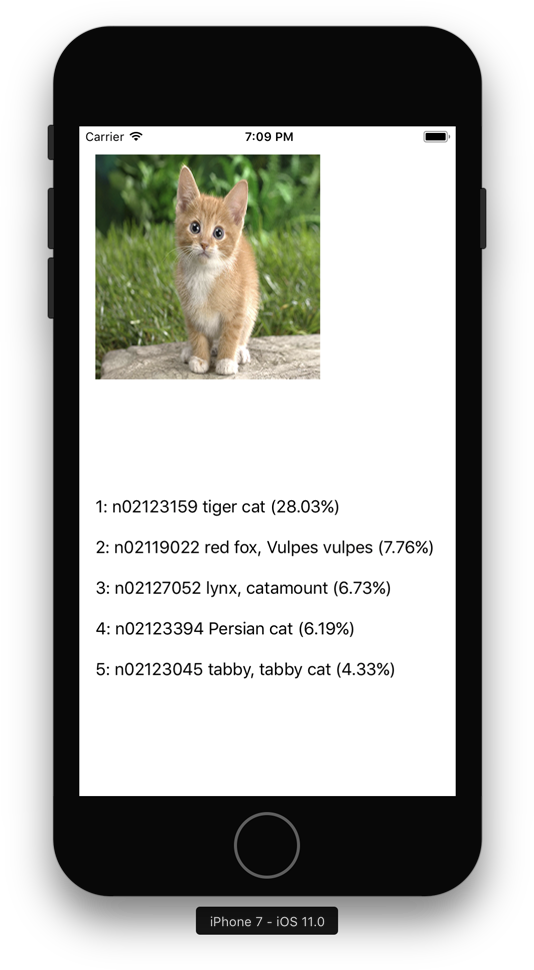

## Cat Detector
This is the **MobileNet** neural network architecture from the paper [MobileNets: Efficient Convolutional Neural Networks for Mobile Vision Applications](https://arxiv.org/abs/1704.04861v1) implemented using Apple's shiny new CoreML framework.

This uses the pretrained weights from [shicai/MobileNet-Caffe](https://github.com/shicai/MobileNet-Caffe).

- **Cat Demo.** Shows the prediction for a cat picture. Open the project in Xcode 9 and run it on a device with iOS 11 or on the simulator. 



## Converting the weights

The repo already includes a fully-baked **MobileNet.mlmodel**, so you don't have to follow the steps in this section. However, in case you're curious, here's how I converted the original Caffe model into this .mlmodel file:

1) Download the **caffemodel** file from [shicai/MobileNet-Caffe](https://github.com/shicai/MobileNet-Caffe) into the top-level folder for this project.

Note: You don't have to download `mobilenet_deploy.prototxt`. There's already one included in this repo. (I added a Softmax layer at the end, which is missing from the original.)

2) From a Terminal, do the following:

```
$ virtualenv -p /usr/bin/python2.7 env
$ source env/bin/activate
$ pip install tensorflow
$ pip install keras==1.2.2
$ pip install coremltools
```

It's important that you set up the virtual environment using `/usr/bin/python2.7`. If you use another version of Python, the conversion script will crash with `Fatal Python error: PyThreadState_Get: no current thread`. You also need to use Keras 1.2.2 and not the newer 2.0.

3) Run the **coreml.py** script to do the conversion:

```
$ python coreml.py
```

This creates the **MobileNet.mlmodel** file.

4) Clean up by deactivating the virtualenv:

```
$ deactivate
```

Done!
